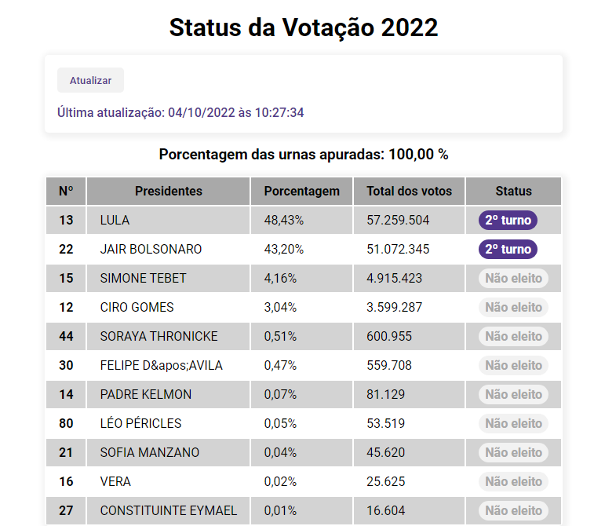

# Acompanhamento das Eleições - 2022

## Preview

Projeto simples que contém dados atuais do TSE referente a última atualização desta eleição, como a quantidade de votos, os presidentes encaminhados ao 2º turno, eleitos, o total de votos e etc. Pra quem deseja saber mais detalhes à respeito deste assunto, siga este link: https://resultados.tse.jus.br/oficial/app/index.html#/eleicao/resultados

## Tecnologias usadas
- [React](https://pt-br.reactjs.org/)
- [React Toastify](https://fkhadra.github.io/react-toastify/introduction)
- [Axios](https://axios-http.com/ptbr/docs/intro)
- [Vite](https://vitejs.dev/)
- API TSE